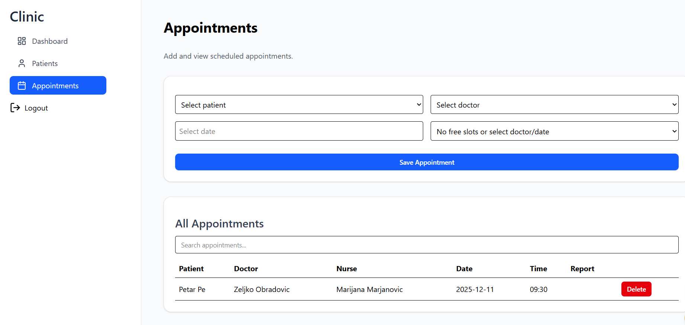

# 🏥 Medical Clinic Management System  
Full-Stack Web Application (Next.js + Django REST Framework)

This project is a complete management system for a private medical clinic.  
It includes role-based access control (Admin, Doctor, Nurse, Patient) and provides full functionality for managing patients, appointments, medical records, users, and services.

---

## 🚀 Tech Stack

### **Frontend**
- React 
- React Query (TanStack Query)
- TailwindCSS 
- Axios
- Vite 
- Recharts
- Lucide React
- React hot toast
- React hook form

### **Backend**
- Django REST Framework
- JWT Authentication
- PostgreSQL
- Django CORS Headers

---

## ✨ Features

### 👤 **Role-Based Access**
 Role | Permissions 
 **Admin**  Manage users, services, appointments, medical records,statistics 
 **Doctor**  View patients, add medical records, diagnoses 
 **Nurse**  Create appointments, assist doctors 
 

---

## 📅 Appointments Module

Nurse & Admin can:
- Create, update, delete appointments
- Select patient & doctor
- Choose date and time

UI Features:
- Expandable appointment card (click to show details)
- Status indicators: **Pending, Completed, Canceled**
- Automatic refresh through React Query

 ## **Live Link**
[Clinic](https://clinic-intern.netlify.app/)

